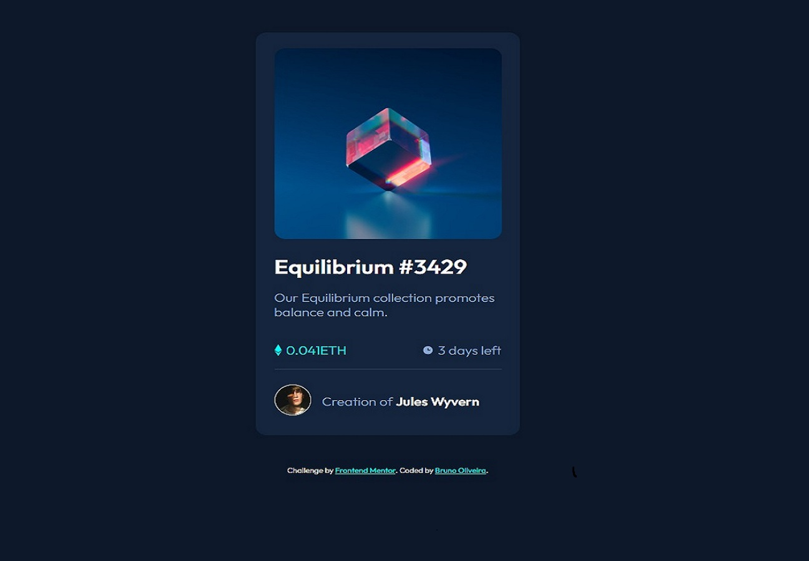

## 📝 Desafio Componente de card NFT preview 
Projeto de desafio do frontend mentor para criação de um componente de card NFT.

## 💻 Screenshot do projeto

Designer 01

<h4 align="center"><a href="https://brunooliveira16.github.io/frontend-mentor-newbie/src/PROJETO-03_NFT_preview_card/index.html" target="_blank">Clique aqui e visite o projeto</a></h4>

## 📚 Descrição
Seu desafio é criar esse componente de cartão de visualização e deixá-lo o mais próximo possível do design.

Você pode usar qualquer ferramenta que desejar para ajudá-lo a concluir o desafio. Portanto, se você tem algo que gostaria de praticar, sinta-se à vontade para tentar.

Seus usuários devem ser capazes de:

- Visualize o layout ideal dependendo do tamanho da tela do dispositivo
- Veja os estados de foco e foco para elementos interativos

<h4><a href="https://www.frontendmentor.io/challenges/nft-preview-card-component-SbdUL_w0U" target="_blank">Link do desafio</a></h4>

---

## 💼 Tecnologias utilizadas
- HTML;
- CSS;

---

## 🙋🏻‍♂️ Autor

Bruno Oliveira
