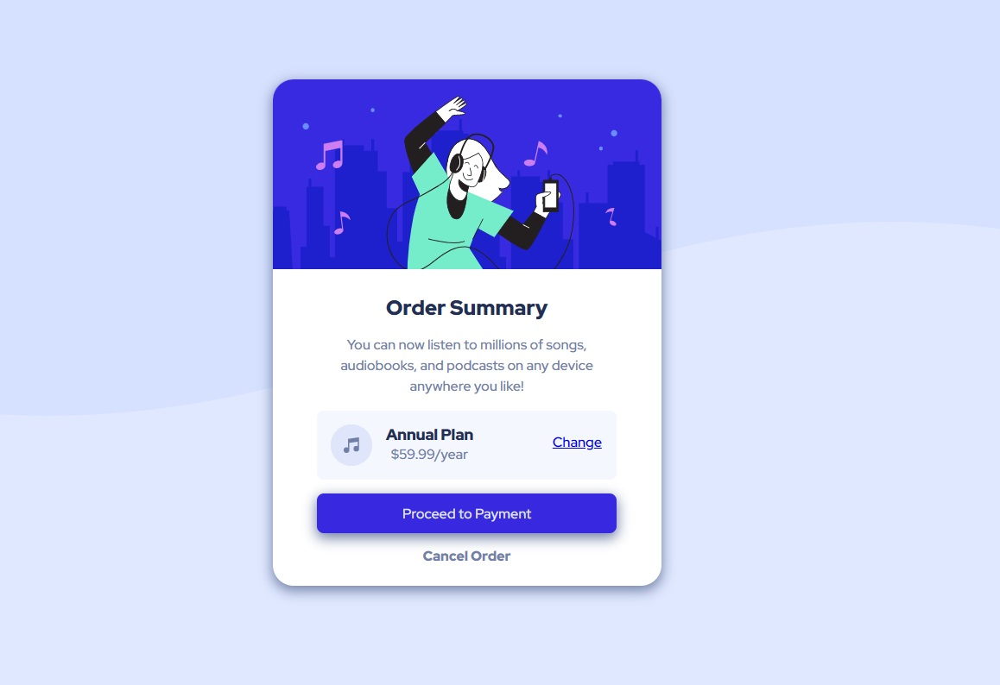

# Componente Sumario de ordens

 

## 📎 Sumário
- 📌 Resumo do Projeto
- ⭐ Features
- 📂 Temas abordados
- ✔️ Tecnologias Utilizadas
- 💻 Demonstração
- 🙋🏻‍♂️ Autor

 

## 📌 Resumo do Projeto
Este é um desafio do site front-end mentor, que consiste em criar um componente responsivo que mostre um sumario de ordens, para proceder com o pagamento.

 

## ⭐ Features
- UI Responsiva
- Botão interativo

 

## 📂 Temas abordados
- Utilização de variaveis css
- Utilização de classes reutilizáveis
- Aplicação de flex-box
- Responsividade

 

## ✔️ Tecnologias Utilizadas

 

## 💻 Demonstração
Para visualizar o projeto <a href="https://brunooliveira16.github.io/frontend-mentor-newbie/src/Projects/project-04-order-summary/index.html" target="__blank"><b>Clique aqui</b></a>

 

## 🙋🏻‍♂️ Autor

| [ Bruno Oliveira](https://github.com/BrunoOliveira16) |
| :---: |