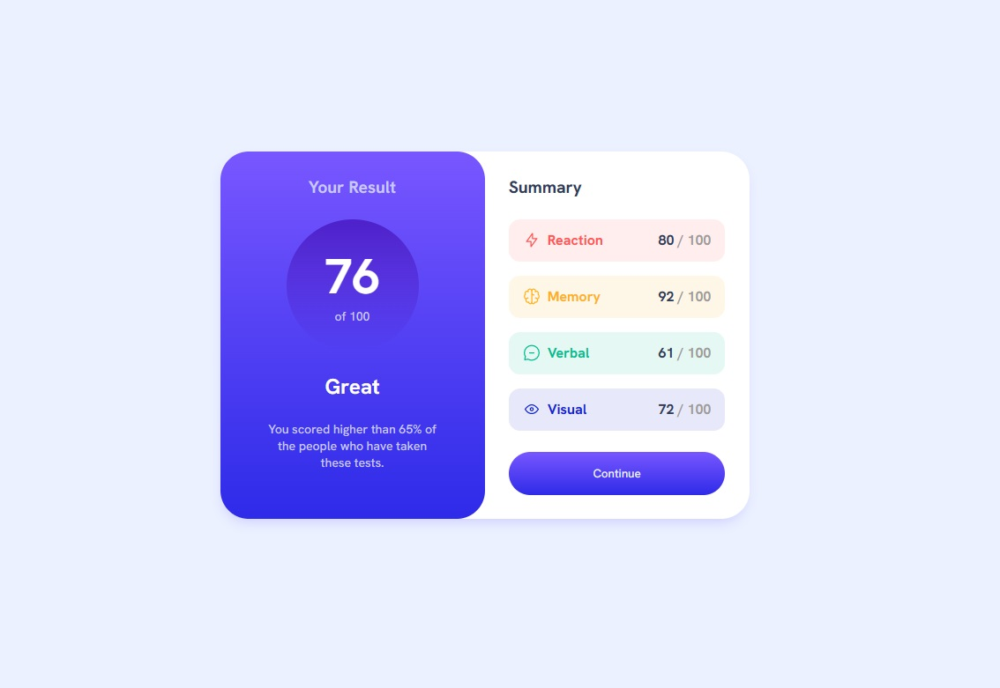

# Componente Sumario de resultados

 

## 📎 Sumário
- 📌 Resumo do Projeto
- ⭐ Features
- 📂 Temas abordados
- ✔️ Tecnologias Utilizadas
- 💻 Demonstração
- 🙋🏻‍♂️ Autor

 

## 📌 Resumo do Projeto
Este é um desafio do site front-end mentor, que consiste em criar um componente responsivo que mostre um sumario de resultados, de acordo com a nota obtida.

 

## ⭐ Features
- UI Responsiva
- Botão interativo
- Sumario gerado dinâmicamente

 

## 📂 Temas abordados
- Utilização de pré-processador sass
- Utilização de variaveis com sass
- Utilização de mixins com sass
- Aplicação de flex-box
- Consumo de dados json através da função fetch
- Geração de html dinâmico na página, por JavaScript

 

## ✔️ Tecnologias Utilizadas

 

## 💻 Demonstração
Para visualizar o projeto <a href="" target="__blank"><b>Clique aqui</b></a>

 

## 🙋🏻‍♂️ Autor

| [ Bruno Oliveira](https://github.com/BrunoOliveira16) |
| :---: |